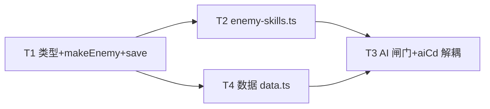

# 敌人技能系统 (Enemy Skills) — 技术规格

**日期**: 2026-08-02  **分支**: main @ `c94609a`  **范围**: 完整数据驱动 effect 系统 + 给约 24 个 caster 类敌人配技能数据

## 1. Context（问题与现状）

darkhollow 的敌人战斗目前**完全靠硬编码 `ai` 字段**（`chase`/`ranged`/`summon`/`teleport`/`phase`/`lifesteal`/`erratic`/`wander`/`ambush`），没有任何数据驱动的"敌人施法"。类型层其实预留了敌人技能：

- [`src/types.ts:176-181 @ c94609a`](https://github.com/xieyj22/darkhollow_win/blob/c94609ae6dce8a4ae400424e98d6e64bac0bf2a9/src/types.ts#L176-L181) — `EnemyDef.skill { name, effect, chance, dmg }` 已定义，但 **`data.ts` 的 ENEMIES 数组（[`L97-188`](https://github.com/xieyj22/darkhollow_win/blob/c94609ae6dce8a4ae400424e98d6e64bac0bf2a9/src/data.ts#L97-L188)）没有任何敌人填写 `skill`**（grep `skill:\s*\{` 只命中 4 个 `CLASSES`）。
- runtime [`Enemy`](https://github.com/xieyj22/darkhollow_win/blob/c94609ae6dce8a4ae400424e98d6e64bac0bf2a9/src/types.ts#L220-L246) 接口**根本没有 `skill` 字段**（只有 `skillCd: number`），且 [`enemy-factory.ts::makeEnemy`](https://github.com/xieyj22/darkhollow_win/blob/c94609ae6dce8a4ae400424e98d6e64bac0bf2a9/src/enemy-factory.ts#L31-L57) 的 `EnemyBase`（L11-15）不读 `skill`，故即便数据层填了也传不到 runtime。
- [`enemies.ts::processEnemies`](https://github.com/xieyj22/darkhollow_win/blob/c94609ae6dce8a4ae400424e98d6e64bac0bf2a9/src/enemies.ts#L158-L286) 的 AI switch（L187-284）从不引用 `enemy.skill`。

对照：**玩家技能已完整接入**（[`skills.ts::executeSkill`](https://github.com/xieyj22/darkhollow_win/blob/c94609ae6dce8a4ae400424e98d6e64bac0bf2a9/src/skills.ts#L60-L228) 造成伤害/治疗，击杀走 `grantKillRewards`/`processAoeKills`）；**元素抗性 `res` 已接入**（[`combat.ts::attack` L86-90](https://github.com/xieyj22/darkhollow_win/blob/c94609ae6dce8a4ae400424e98d6e64bac0bf2a9/src/combat.ts#L86-L90) 算 `def.res?.[atkEl]` 进 `elMult`）。两者均无需改动。

本特性补齐唯一缺失的"敌人施法"，对标玩家 `executeSkill` 做一套**数据驱动、effect key 路由到 handler 表**的通用管线，并给 ~24 个 caster 类敌人（`mage`/`cultist`/`spirit`/`elemental`/`seraph`/`dragon` tag + 语义施法者如 Siren/Spore Mother）配技能数据。

## 2. Proposed Changes

### 2.1 类型层（`types.ts` + `enemy-factory.ts`）

扩展 `EnemyDef.skill` 为完整可驱动结构，`Enemy` runtime 携带同结构字段：

```ts
// 共用结构（types.ts 导出 EnemySkill）
interface EnemySkill {
  name: I18nText; effect: string;   // effect key → enemy-skills.ts handler
  chance: number;                    // 0..1 per eligible turn
  cd: number;                        // cooldown turns
  dmg?: number;                      // atk 倍率(dmg_*) 或强度(buff/debuff)
  range?: number;                    // 施法射程(缺省按 effect)
  aoe?: number;                      // AOE 半径 或 状态回合数(debuff_*/buff)
  el?: Element;                      // 技能元素(缺省取敌人 el)
}
// EnemyDef.skill?: EnemySkill;  Enemy.skill?: EnemySkill;  Enemy.aiCd?: number;
```

`enemy-factory.ts`：`EnemyBase` 加 `skill?: EnemySkill`；`makeEnemy` 在返回对象里深拷贝（与 `res`/`tags` 同模式，[`L53-55`](https://github.com/xieyj22/darkhollow_win/blob/c94609ae6dce8a4ae400424e98d6e64bac0bf2a9/src/enemy-factory.ts#L53-L55)）：
`skill: base.skill ? { ...base.skill, name: { ...base.skill.name } } : undefined`。深拷贝 `name` 防同类敌人共享 `I18nText` 引用（`name` 虽只读，但深拷贝是安全默认，与 `res`/`tags` 一致）。

### 2.2 新建 `src/enemy-skills.ts`（handler 表 + 决策纯函数）

导出两个函数：

- **`shouldCastSkill(e, dist, visible, playerInvis): boolean`** — 纯函数决策，集中所有"不施法"判定：`!e.skill` / `e.skillCd > 0` / `dist > (e.skill.range ?? effectDefault)` / (`playerInvis && dist > 2`)。提取为纯函数便于单测。
- **`executeEnemySkill(caster, skill): void`** — `switch(skill.effect)` 路由到 11 个 handler。**伤害统一走 `attack(caster, G.player, false)`**（复用抗性/暴击/法穿/腐蚀/Mana Shield/talent 触发，DRY + 平衡一致）。

effect handler 表（实现一次，数据驱动 N 敌人）：

| effect | 行为 | 目标 | fx |
|---|---|---|---|
| `dmg_bolt` | 临时 `caster.atk *= dmg` 后 `attack(caster, player, false)`，还原 atk | 玩家(射程内+可见) | `fxBeam` |
| `dmg_aoe` | 玩家走 attack(无视 dodge);范围内**盟友**直接 `ally.hp -= rawDmg`(不走 attack,见 §2.4) | 玩家+盟友(`aoe`半径) | `fxBurst` |
| `heal` | 治自己 `min(maxHp, hp+dmg*atk)` 或最近受伤同伴 | 自己(hp%低)/同伴 | `fxFlash`绿 |
| `buff` | `caster.buffs.push({type:'str_buff'\|'def_buff', value:dmg, turns:aoe})` | 自己 | `fxAura` |
| `debuff_poison` | `player.poisonTurns=aoe; player.poisonDmg=max(...,dmg)` | 玩家 | 绿毒雾`fxBurst` |
| `debuff_slow` | `player.slowed=max(player.slowed,aoe)` | 玩家 | 冰蓝`fxFlash` |
| `debuff_weaken` | `player.buffs.push({type:'weak', value:dmg, turns:aoe})`(recalc 时减 atk) | 玩家 | 紫`fxFlash` |
| `debuff_stun` | `player` 受击后眩晕：复用敌人 stun 机制对玩家→新增 `player.stunned?`(见 §2.4) `=min(2,aoe)` | 玩家 | ⚡`fxFlash` |
| `blink` | 复用 teleport 落点逻辑(不落墙/玩家/敌)贴脸 | 自身位移 | `⚡BLINK` |
| `summon` | 复用 `bossSummonAdd` 管线(`G.enemies.length<30` cap)召唤 1 小怪 | 新增敌人 | `⚡SUMMON` |

### 2.3 AI 集成（`enemies.ts`）+ `skillCd` 解耦

在 `processEnemies` 的 `switch(e.ai)` **之前**插施法闸门（`skillCd` 递减已在 [`L170`](https://github.com/xieyj22/darkhollow_win/blob/c94609ae6dce8a4ae400424e98d6e64bac0bf2a9/src/enemies.ts#L170)）：

```
const d = dst(...);
if (shouldCastSkill(e, d, visible, playerInvis)) {
  executeEnemySkill(e, e.skill!); e.skillCd = e.skill!.cd;
  if (G.gameOver) return; continue;   // 本回合施法,跳过常规 ai
}
// 否则照常 switch(e.ai)
```

**`skillCd` 解耦（关键重构）**：现 `summon` ai([L239-240](https://github.com/xieyj22/darkhollow_win/blob/c94609ae6dce8a4ae400424e98d6e64bac0bf2a9/src/enemies.ts#L239-L240))/`teleport` ai([L262-263](https://github.com/xieyj22/darkhollow_win/blob/c94609ae6dce8a4ae400424e98d6e64bac0bf2a9/src/enemies.ts#L262-L263))/`tryBossSummon`([L314/319/320](https://github.com/xieyj22/darkhollow_win/blob/c94609ae6dce8a4ae400424e98d6e64bac0bf2a9/src/enemies.ts#L303-L322)) 都读写 `skillCd` 做行为冷却。给这些敌人配 skill 后两套冷却打架。**解法**：新增 `Enemy.aiCd?`，把上述 4 处非技能用途的 `skillCd` 读写改为 `aiCd`；`processEnemies` L170 的递减改为同时递减 `skillCd` 和 `aiCd`。从此 `skillCd` 专属于技能。`save.ts` 加 `aiCd === undefined ? 0` 守卫（同 `skillCd` 现有守卫模式，[`L117`](https://github.com/xieyj22/darkhollow_win/blob/c94609ae6dce8a4ae400424e98d6e64bac0bf2a9/src/save.ts#L117)）。

### 2.4 实现要点与边界（防回归）

- **AOE 打盟友不能走 `attack`**：`attack(e, ally, false)` 的 `!isP` 分支会把防守方当玩家（触发 dodge/ward/corruption/`onPlayerDamaged`）。`dmg_aoe` 对盟友单独 `ally.hp -= rawDmg` + fx，击杀走 `killEnemy(ally)`。
- **`debuff_stun` 玩家端机制**：玩家目前无 `stunned`（仅敌人有）。新增 `Player.stunned?: number`；**玩家行动入口**(`input.ts` 的移动/攻击处理)在执行前检查 `stunned>0` → 不实际移动/攻击、消息「你被眩晕，无法行动」、`stunned--`、照常 `endTurn`(消耗回合让敌人动) = 玩家"丢失回合"。净化可解(`holy_water` 已清毒，扩展清 stun / Paladin 圣光 cleanse)。控场强度由 §6 缓解措施兜底。
- **`dmg_aoe` 对玩家"无视 dodge"的实现**：`attack` 的 `!isP` 分支自带 dodge 判定（[`combat.ts:71`](https://github.com/xieyj22/darkhollow_win/blob/c94609ae6dce8a4ae400424e98d6e64bac0bf2a9/src/combat.ts#L71)）。实现 = 临时抑制：`const od=G.player.dodgeChance; G.player.dodgeChance=0; attack(caster,player,false); G.player.dodgeChance=od;`（局部 hack，**不改 attack 本体**，零回归）。
- **隐身尊重**：`shouldCastSkill` 已含 `playerInvis && dist > 2` 不施。
- **`gameOver` 短路**：`executeEnemySkill` 入口 + handler 内 `attack` 后均检查。

### 2.5 数据配对（`data.ts`，~24 个 caster）

每个 EnemyDef 加 `skill: {...}`。按主题分组（完整数值见 brainstorming Section B 表格，写入计划文档时逐条落 `data.ts`）：

- **暗影法师**(dmg_bolt/dmg_aoe shadow)：Cultist / Dark Mage / Lich / Void Mage；Necromancer 用 `debuff_weaken`
- **幽灵**(debuff/dmg_aoe)：Wraith(slow) / Cinder Wraith / Storm Wraith / Void Wraith(poison)
- **龙**(dmg_aoe 喷吐)：Wyvern / Dragon Whelp(bolt) / Ancient Dragon / Pyro Drake
- **元素/恶魔/天使**(高威胁)：Fire Imp / Magma Behemoth / Chaos Elemental / Seraphim / Fallen Seraph / Archon / Doom Seraph(无尽)
- **辅助控场**：Inquisitor(weaken) / Siren(slow) / Spore Mother(poison,分支) / Drake Zealot(buff) / Reality Shard(weaken)

**平衡基准**：`dmg` 是 atk 倍率（单体 bolt 1.6–2.0、AOE 1.3–1.7，AOE 低因覆盖+无视 dodge）；`chance` 0.3–0.45；`cd` 3–6。中后期 atk 30–50 → 单次技能约 40–80 伤害（玩家 maxHp 数百），有威胁但不秒杀。

## 3. End-to-end Flow（一次施法）

```
processEnemies 遍历敌人 e → e.skillCd>0 递减(L170) → boss summon/平砍/移动判定前
  → shouldCastSkill(e,dist,visible,invis)? 
     yes → executeEnemySkill(e,e.skill) [switch effect → handler,伤害走 attack] 
           → e.skillCd = e.skill.cd → continue(跳过 ai)
     no  → switch(e.ai) 原行为
```

## 4. Testing and Validation

沿用现 141 测基座（vitest + happy-dom）。

- **`enemy-skills.test.ts`（新）**：`vi.mock` `./fx.js`/`./effects.js`/`./audio.js`（参考 [`grantKillRewards.test.ts`](https://github.com/xieyj22/darkhollow_win/blob/c94609ae6dce8a4ae400424e98d6e64bac0bf2a9/src/__tests__/grantKillRewards.test.ts) 现成 mock 模式），构造最小 `G`(player+enemies)。逐 handler：`dmg_bolt`→player.hp 减、`dmg_aoe`→盟友也扣血+无视 dodge、各 `debuff_*`→player 字段正确、`buff`→caster.buffs、`heal`≤maxHp、`shouldCastSkill` 纯函数全分支(cd/距离/invis/chance/!skill)。
- **扩展 `makeEnemy-real-data.test.ts`**：断言每个配 skill 的 EnemyDef，makeEnemy 后 `enemy.skill` 深拷贝等值且 `!==` 原引用（防浅拷贝）。
- **扩展 `makeEnemy.test.ts`**：`def.skill` 拷贝到 runtime 的 characterization。
- **save 兼容**：`loadGame` 老 Enemy(无 skill/aiCd)→不崩、`shouldCastSkill` 返回 false。
- **回归**：`npm run build`(tsc+vite) exit 0 + 全量 vitest 绿 + 无头冒烟(playwright：进入有 caster 的楼层，确认施法 fx/消息/伤害正常、不崩；analyze_image 抓一帧)。

## 5. Parallelization

darkhollow 用 superpowers subagent-driven；本仓历史有 GLM-5.1 5h 用量上限触发 429 杀并发 subagent 的坑（节流 ≤3/波，主循环仍可用→主 Agent 内联兜底，见 `[[subagent-parallel-gotchas]]`）。

依赖图与文件归属：
- **T1 类型+makeEnemy+save**（types.ts/enemy-factory.ts/save.ts）— 基础，**必须先行**（T2/T3/T4 都依赖新类型）
- T1 完成后可分叉：**T2 enemy-skills.ts**(新文件) 与 **T4 数据**(data.ts) 文件不重叠，可同波并行(2 并发)
- **T3 AI 集成+aiCd 解耦**(enemies.ts) 依赖 T2 的 `executeEnemySkill`/`shouldCastSkill`，T2 完成后做



**建议**：T1 主 Agent 内联（基础+改动 types 影响全局，需 hand-tune）；T2+T4 一波（≤2 并发 subagent，文件隔离）；T3 主 Agent 内联（enemies.ts 是 AI 热点，aiCd 解耦易出错，需仔细）。每个 subagent 带 implementer+task-reviewer，final opus whole-branch review。撞 429 则主 Agent 内联接手（沿用 6b/6d 经验）。

## 6. Risks & Mitigations

- **`debuff_stun` 玩家端控场风险**：玩家"丢回合"连续发生会 frustrating（roguelike 大忌）。缓解（已在 Section C 认可）：时长硬上限 2 回合 + `Math.max` 不叠加延长 + boss 的 stun 技能 chance 降至 0.25 + 单敌人 cd≥5 + 净化(holy_water/圣光)可解。
- **`dmg_aoe` 盟友伤害走 attack 的陷阱**：见 §2.4，已明确单独扣血路径。
- **`aiCd` 解耦遗漏**：enemies.ts 有 4 处 `skillCd` 非技能用途，漏改会导致 summon/teleport/boss summon 行为错乱。**硬门**：`grep 'skillCd' src/enemies.ts` 改完后应只剩技能闸门那处 + L170 递减（递减改为同时 `aiCd`）。
- **平衡**：24 敌人一次性加技能，AOE 无视 dodge 可能克制闪避流过狠。数值(playtest 调)——首版取保守值，标记待 playtest。

## 7. Follow-ups

- 剩余 caster 完善与技能丰富化（chain lightning、ground fire、rampage 等高级 effect）
- 给非 caster（近战 brute/knight）配"战吼/冲撞"类技能（方案 C 覆盖面，本版不做）
- boss 专属多技能/阶段技能（现 boss 用 phases/summon，可叠加 skill）

数值取 brainstorming Section B 表的保守值直接落（§2.5 基准），playtest 后再调。
