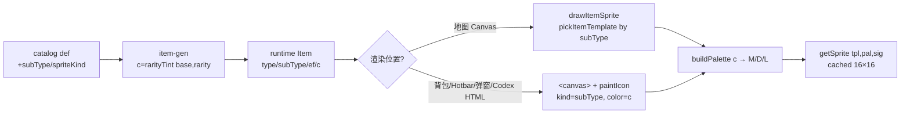

# 道具图标统一与差异化 优化 — 技术规格

**日期**: 2026-08-03 ｜ **基线**: `feat/item-intro @ 12308eb` ｜ **仓库**: [xieyj22/darkhollow_win](https://github.com/xieyj22/darkhollow_win)
**范围**: 把道具图标从"地图 sprite / 背包 glyph / 遗物 emoji 三套割裂"统一为全位置像素 sprite，并增加同类道具的视觉区分（稀有度换色 + 子类型模板）。在 `feat/item-intro` 分支继续（复用子系统 A 的弹窗/Codex 代码）。

---

## Context

### 现状（基线 12308eb）

**两套并行渲染，互不统一**：
- **地图**（[`render.ts:302-321`](https://github.com/xieyj22/darkhollow_win/blob/12308eb/src/render.ts#L302-L321)）：16×16 像素 sprite，调 [`drawItemSprite`](https://github.com/xieyj22/darkhollow_win/blob/12308eb/src/sprites.ts#L1104)（已是像素画）。
- **背包**（[`panels.ts:83`](https://github.com/xieyj22/darkhollow_win/blob/12308eb/src/panels.ts#L83)）/ **Hotbar**（[`items.ts:287`](https://github.com/xieyj22/darkhollow_win/blob/12308eb/src/items.ts#L287)）/ **拾取弹窗**（[`item-intro.ts:106`](https://github.com/xieyj22/darkhollow_win/blob/12308eb/src/item-intro.ts#L106)）：单字符 glyph `${item.ch}`。
- **Codex 图鉴**（[`ui-panels.ts:241-269`](https://github.com/xieyj22/darkhollow_win/blob/12308eb/src/ui-panels.ts#L241-L269)）：纯文字名称，**无图标**。
- **遗物**：emoji（`def.ch` 如 🗡️🦷🔥），与普通道具的 Unicode glyph 风格不一。

**同类道具无法区分**：
- [`pickItemTemplate`](https://github.com/xieyj22/darkhollow_win/blob/12308eb/src/sprites.ts#L1084) 模板只有 ~16 个，护甲整类共用 `I_SHIELD`、饰品共用 `I_RING`、卷轴共用 `I_SCROLL`、食物共用 `I_FOOD`。武器按 name 正则分 7 种（[`pickWeaponTemplate:1073`](https://github.com/xieyj22/darkhollow_win/blob/12308eb/src/sprites.ts#L1073)）。
- 武器/护甲/饰品的颜色 `c` 在 [`item-gen.ts:40/50/57`](https://github.com/xieyj22/darkhollow_win/blob/12308eb/src/item-gen.ts#L40) **硬编码为类型级常量**（武器 `#f4845f` / 护甲 `#7ec8e3` / 饰品 `#06d6a0`），所有同类同色。后果：所有剑同款橙色 + 同款 `W_SWORD`，看不出锈剑 vs 斩首剑。

**可复用基础**：
- [`buildPalette(main)`](https://github.com/xieyj22/darkhollow_win/blob/12308eb/src/sprites.ts#L919)：`M/D/L` 从传入色派生 → **改 `item.c` 即改 sprite 调色板**。
- [`paintIcon(target, kind, color)`](https://github.com/xieyj22/darkhollow_win/blob/12308eb/src/sprites.ts#L1115)：画进 16×16 `<canvas>`，帮助面板（[`panels.ts:148-221`](https://github.com/xieyj22/darkhollow_win/blob/12308eb/src/panels.ts#L148-L221)）已在用 —— HTML 面板接入 sprite 的现成范例。
- [`getSprite`](https://github.com/xieyj22/darkhollow_win/blob/12308eb/src/sprites.ts#L959) + `spriteCache`/`silCache`：按 sig 缓存，性能无忧。
- `RARITY_C` = `['#c0c0c0','#06d6a0','#4895ef','#9b5de5','#ffd700']`（[`i18n.ts:587`](https://github.com/xieyj22/darkhollow_win/blob/12308eb/src/i18n.ts#L587)）。
- 零图片资源，全程序化（字符串矩阵 + 调色板）。

---

## Proposed changes

分四波（W1-W4），每波独立可测、可单独 commit。

### W1 · 渲染统一 + 稀有度换色

**1. paintIcon 接入四处 HTML 面板**（glyph → sprite）
- 背包 `renderInv`（panels.ts:83）、Hotbar `renderHotbar`（items.ts:287）、拾取弹窗 `renderCard`（item-intro.ts:106）、Codex `renderItemSection`（ui-panels.ts:241-269）：把 `${ch}` 换成 `<canvas class="lic" data-kind="…" data-color="…">`，渲染后遍历调 `paintIcon(canvas, kind, color)`。
- `kind` = 模板 key（W2 后由 subType 决定，W1 先用 `pickItemTemplate` 推导的 key）；`color` = `item.c`。
- Hotbar 小格（15px）：16×16 canvas + CSS `image-rendering:pixelated` 放大；验证清晰度，必要时 hotbar 用 20-24px。
- 遗物（item-intro.ts:81 / panels.ts 遗物行）：W1 暂保留 `def.ch`，W3 统一。

**2. 稀有度换色**（修 item-gen.ts:40/50/57）
- 武器/护甲/饰品的 `c` 从硬编码类型色 → `rarityTint(typeBase, rarity)`。
- **策略：类型色为基 + rarity 增强饱和度/亮度**（保留"一眼认类型"，rarity 拉开差异）。例如武器基色暖橙系，rarity 0 偏暗淡、rarity 3-4 增亮饱和、rarity 5（无尽）用紫 `#9b5de5`。
- 新增工具函数 `rarityTint(base: string, rarity: number): string`（放 sprites.ts 或 utils.ts，复用现有 `darken`/`lighten`/`saturate`；若 utils 无 saturate 则加）。
- 地图 rarity≥4 的金光晕（render.ts:307）保留。
- `drawItemSprite` 的 sig `type:ef:c`（sprites.ts:1109）天然按新 c 分缓存，无需改。

### W2 · 子类型模板扩展

**1. catalog 加 `subType?: string` 字段**（types.ts 目录类型 + data.ts 各条目）
- 给护甲/饰品/卷轴/食物/消耗品补 subType（武器已有 7 种 name 路由，可保留或也迁到 subType）。
  - 护甲：`plate`/`leather`/`cloak`/`robe`/`scale`（~5）
  - 饰品：`ring`/`amulet`/`brooch`/`crown`（~4）
  - 卷轴：按学派 `fire`/`frost`/`arcane`/`holy`（~3-4）
  - 食物：`meat`/`bread`/`fruit`/`feast`（~4）
  - 消耗品：`bomb`/`trap`/`pouch`/`tool`（~4）
- 由 subagent 按类别批量补（仿子系统 A flavor），主 agent 收口。

**2. 扩 ~20-25 个 16×16 模板**（sprites.ts TEMPLATES）
- 每个子类型一个 `I_*` / `SC_*` / `FD_*` 模板（复用现有矩阵格式 + `buildPalette`）。
- subagent 按类别并行画（像素矩阵），主 agent 收口保风格统一。

**3. pickItemTemplate 按 subType 路由**（sprites.ts:1084）
- `case 'armor': return TEMPLATES['I_' + (item.subType||'shield').toUpperCase()]` 之类。
- `drawItemSprite` 的 sig 加 subType：`type:ef:subType:c`，保缓存正确。

### W3 · 遗物 sprite（emoji → 像素）

- `RELICS` 加 `spriteKind?: string`（或按 `effect` 字段路由）。
- 按 theme/effect 分 ~8-12 个遗物模板（`R_ATTACK`/`R_DEFENSE`/`R_ARCANE`/`R_SOUL`/`R_NATURE`/`R_VOID`...），26 圣物映射到这些模板 + 各自 `def.c` 换色。
- pickItemTemplate 增 `case 'relic'`（或独立 `pickRelicTemplate(def)`）；item-intro.ts:81 / panels.ts 遗物行 / Codex 遗物段统一切到 sprite。

### W4 · 验证

- 全位置图标正确（地图/背包/Hotbar/弹窗/Codex/遗物）。
- sprite cache 性能（sig 含 subType 后缓存条目数可控）。
- 中英切换 + rarity 跨档视觉一致。

---

## End-to-end flow

---

## Testing and validation

**单元测试**（vitest）
- `rarityTint(base, r)`：rarity 越高输出越亮/饱和；rarity 5 返回紫；确定性（同输入同输出）。
- `pickItemTemplate`：各 subType 路由到正确模板 key；缺 subType 时回退默认。
- catalog subType 完整性：每个护甲/饰品/卷轴/食物/消耗品条目都有合法 subType（仿 item-data-integrity.test.ts）。
- sprite cache sig 含 subType 后无错位。

**手动验证**（dev server HMR 实时看）
1. 地图道具 = 背包/Hobtar/弹窗/Codex 图标**完全一致**（同 sprite）。
2. 同类不同 rarity 道具颜色有差异（普通剑暗淡、史诗剑鲜艳、无尽剑紫）。
3. 护甲/饰品/卷轴/食物按 subType 显示不同形状。
4. 遗物显示像素 sprite（无 emoji）。
5. Hotbar 小图标清晰（pixelated 放大无糊）。
6. sprite cache 不膨胀（开 devtools 看 spriteCache.size 稳定）。

---

## Parallelization

**适合并行：模板创作**（W2 + W3 的像素矩阵）。仿子系统 A flavor 的成熟并行法：
- subagent 按类别分波画 16×16 矩阵（每波一个 subagent 产出该类全部模板的字符串矩阵 JSON），主 agent 收口校验风格 + 回填 sprites.ts。
- 节流 ≤3 并发，波间留间隔（避免 API 429）。
- 风格指南：16×16、复用 `buildPalette` 的 M/D/L/E/K/W/C/G/N 码、与现有道具/敌人 sprite 同密度同描边风格。
- 执行模式：local；subagent 只产出矩阵文本，不直接改 sprites.ts（避免并发冲突）。

**顺序执行**：W1 接入 + rarity 换色、pickItemTemplate 路由改、各处 paintIcon 接线 —— 强依赖与文件耦合，主 agent 串行。

---

## Risks and mitigations

- **rarity 换色丢失类型识别**：纯 RARITY_C 换色会让同 rarity 武器/护甲同色。→ 采用"类型基色 + rarity 增强"策略（§W1-2），保类型色相 + rarity 明度差。
- **Hotbar 15px 格 sprite 糊**：16×16 缩到 15px 会丢像素。→ CSS `image-rendering:pixelated` + 必要时 hotbar icon 升到 20-24px（CSS 已有 .hb-icon 字号控制）。
- **sprite cache 膨胀**：subType 加入 sig 后，缓存条目 = type×subType×ef×c 组合。→ c 已按 rarity 离散（5 档），subType 有限（~25），组合数可控（<200）；getSprite 已有 cache，无需改架构。
- **paintIcon 接入性能**：背包/H otbar 每次渲染遍历 canvas 调 paintIcon。→ paintIcon 内部 getSprite 已缓存（按 sig），重绘成本低；renderHotbar/renderInv 本就是全量 innerHTML 重建，增量可忽略。
- **遗物 emoji → sprite 风格断裂**：玩家可能习惯 emoji 圣物。→ 遗物 sprite 用更精致模板（R_* 系列，带发光 E 码），视觉上"升级"而非"降级"。
- **subType 字段迁移**：旧存档 Item 无 subType。→ subType 设为可选，pickItemTemplate 回退默认模板（与现状一致），无存档迁移。

---

## Follow-ups

- 武器 name 正则路由（pickWeaponTemplate）也可迁到 subType 字段，统一路由机制（本次保留 name 正则，低风险）。
- 每件道具独一模板（~60+）若未来需要，按 catalog id 扩。
- sprite 作为图鉴缩略图在 Codex 可放大显示（spec §A4 follow-up：codex 显示 flavor + 大图）。
