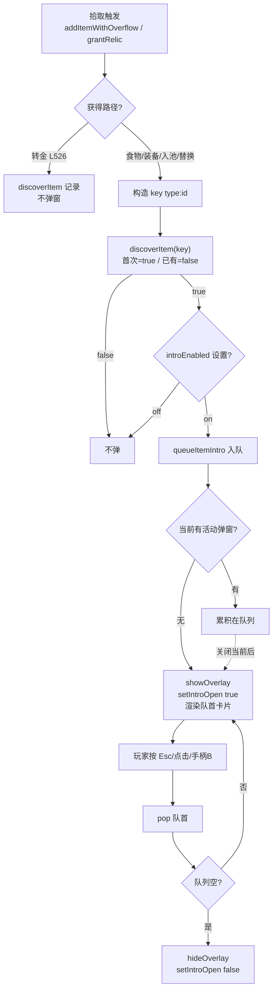

# 道具图鉴介绍系统（首次拾取弹窗）— 技术规格

**日期**: 2026-08-03 ｜ **基线**: `main @ 475c716d` ｜ **仓库**: [xieyj22/darkhollow_win](https://github.com/xieyj22/darkhollow_win)
**范围**: 子系统 A —— 首次拾取任意道具/圣物时弹出介绍卡片 + 跨局道具图鉴。**设置面板优化（子系统 B）另开 spec，本份不涉及。**

---

## Context

### 要解决的问题
玩家首次拾起一件道具/圣物时，没有任何"它是什么、有什么效果、作用范围多大"的介绍。属性摘要只在背包 tooltip 里被动出现。需要：**第一次见到某件道具就主动弹出介绍卡片**（暂停游戏），并把"已发现"沉淀为跨局的道具图鉴。第二次及以后拾取不再弹。

### 现状与可复用基础（基线 475c716d）

**拾取入口**
- 普通道具统一走 [`addItemWithOverflow`](https://github.com/xieyj22/darkhollow_win/blob/475c716d/src/items.ts#L464)（[`src/items.ts:464`](https://github.com/xieyj22/darkhollow_win/blob/475c716d/src/items.ts#L464)）。调用方：移动自动拾取 [`player.ts:90-104`](https://github.com/xieyj22/darkhollow_win/blob/475c716d/src/player.ts#L90-L104)、手动 `pickupItem` [`player.ts:117-133`](https://github.com/xieyj22/darkhollow_win/blob/475c716d/src/player.ts#L117-L133)、商人/宝箱/endless 商人 [`events.ts`](https://github.com/xieyj22/darkhollow_win/blob/475c716d/src/events.ts)。
- 圣物统一走 [`grantRelic`](https://github.com/xieyj22/darkhollow_win/blob/475c716d/src/relics.ts#L165)（[`src/relics.ts:165`](https://github.com/xieyj22/darkhollow_win/blob/475c716d/src/relics.ts#L165)），它**已经**调 `unlockLore('relic:'+id)` 接入剧情图鉴。

**目录与类型** —— 全部静态目录在 [`data.ts`](https://github.com/xieyj22/darkhollow_win/blob/475c716d/src/data.ts)，类型在 [`types.ts`](https://github.com/xieyj22/darkhollow_win/blob/475c716d/src/types.ts)
- 目录类型 [`types.ts:59-123`](https://github.com/xieyj22/darkhollow_win/blob/475c716d/src/types.ts#L59-L123)：`WeaponDef`/`ArmorDef`/`AccessoryDef`/`PotionDef`/`ScrollDef`/`ConsumableDef`/`FoodDef`。**普通道具目录基本无介绍文本**（仅 `ConsumableDef` 有 `desc`），且**无唯一 `id` 字段**。圣物 [`RelicDef types.ts:508`](https://github.com/xieyj22/darkhollow_win/blob/475c716d/src/types.ts#L508) 已有 `id` + 双语效果说明 `d: I18nText`。
- 运行时实例 [`Item types.ts:138`](https://github.com/xieyj22/darkhollow_win/blob/475c716d/src/types.ts#L138)：有 `type/name/rarity/ch/c/desc/atk/def/hp/ef/val/dur/el/set` 等，**无 `id`**。`Item.desc` 是 [`item-gen.ts`](https://github.com/xieyj22/darkhollow_win/blob/475c716d/src/item-gen.ts) 生成时拼出的属性摘要（如"攻击+5"），不是背景介绍。
- 数量：普通道具 7 类约 94 个目录条目（武器 26 / 护甲 16 / 饰品 14 / 药水 12 / 卷轴 9 / 消耗品 13 / 食物 4）+ 圣物 28 个（[`data.ts:683`](https://github.com/xieyj22/darkhollow_win/blob/475c716d/src/data.ts#L683) `RELICS`）。

**发现/持久化范式** —— 直接复用
- [`MetaSave types.ts:559`](https://github.com/xieyj22/darkhollow_win/blob/475c716d/src/types.ts#L559) 已有 `unlockedLore: string[]`（剧情图鉴）和 `achievements`。读写在 [`meta.ts:30-52`](https://github.com/xieyj22/darkhollow_win/blob/475c716d/src/meta.ts#L30-L52) `getMeta/saveMeta`，含向后兼容迁移。
- 幂等解锁的现成模板：[`unlockLore meta.ts:230`](https://github.com/xieyj22/darkhollow_win/blob/475c716d/src/meta.ts#L230)（首次插入、去重、`saveMeta`）。

**Overlay 弹窗系统** —— 直接复用
- [`showOverlay/hideOverlay ui-panels.ts:154/168`](https://github.com/xieyj22/darkhollow_win/blob/475c716d/src/ui-panels.ts#L154) 已提供淡入动画 + 焦点陷阱 + 焦点恢复。DOM 模式：`<div id="x-overlay" class="overlay"><div class="panel"><button class="close-btn">…`。
- 输入拦截靠 `state.ts` 的 flag（`invOpen/helpOpen/...`），[`input.ts`](https://github.com/xieyj22/darkhollow_win/blob/475c716d/src/input.ts) 在 flag 打开时阻止底层移动。
- [`renderCodex ui-panels.ts:210`](https://github.com/xieyj22/darkhollow_win/blob/475c716d/src/ui-panels.ts#L210) 已是"按 discovered 集合显示已发现/🔒"的列表范式 —— 道具图鉴页照抄。

---

## Proposed changes

### A1 · 数据层（id + flavor + discovered 跟踪）

**1. 目录类型加 `id` + `flavor`**（[`types.ts:59-123`](https://github.com/xieyj22/darkhollow_win/blob/475c716d/src/types.ts#L59-L123)）
- `WeaponDef`/`ArmorDef`/`AccessoryDef`/`PotionDef`/`ScrollDef`/`ConsumableDef`/`FoodDef` 各加 `id: string`（语义化 snake_case，如 `iron_sword`、`heal_potion`）+ `flavor: I18nText`。
- `RelicDef` 加 `flavor?: I18nText`（已有 `id`，无需加）。
- 在 [`data.ts`](https://github.com/xieyj22/darkhollow_win/blob/475c716d/src/data.ts) 给 ~94 个普通目录条目 + 28 个圣物补 `id` 与 `flavor`（双语）。**id 必须全表唯一**，新增单测守卫。
- `id`/`flavor` 由 subagent 按类别分波批量生成（见 Parallelization），主 agent 收口校验风格统一。

**2. 运行时 `Item` 加 `id`**（[`types.ts:138`](https://github.com/xieyj22/darkhollow_win/blob/475c716d/src/types.ts#L138)）
- 加可选 `id?: string`。[`item-gen.ts`](https://github.com/xieyj22/darkhollow_win/blob/475c716d/src/item-gen.ts) 生成实例时赋 `item.id = def.id`。圣物实例不存在（`Player.relics: string[]` 只存 id），无需改。
- 旧存档 `Item` 无 `id`：不影响，因为旧存档已持有的道具不会再触发"首次拾取"；新拾取都走 item-gen（有 id）。

**3. `MetaSave.discoveredItems` + 幂等 `discoverItem`**（[`types.ts:559`](https://github.com/xieyj22/darkhollow_win/blob/475c716d/src/types.ts#L559)、[`meta.ts`](https://github.com/xieyj22/darkhollow_win/blob/475c716d/src/meta.ts)）
- `MetaSave` 加 `discoveredItems: string[]`；`getMeta` 迁移逻辑加 `if (!m.discoveredItems) m.discoveredItems = []`（仿 `unlockedLore` 迁移）。
- 新增 `discoverItem(key: string): boolean` —— **首次返回 `true` 并 `saveMeta`，已存在返回 `false`**（比 `unlockLore` 多一个返回值，用于决定是否弹窗）。key 格式 `<type>:<id>`，如 `weapon:iron_sword`、`relic:war_totem`。
- 与 `unlockedLore` 解耦：剧情图鉴归 `unlockedLore`，道具图鉴归 `discoveredItems`，两套语义独立。

**4. flavor 风格指南**（写入本 spec §A1-4，subagent 必须遵循）
- **基调**：契合 darkhollow 世界观（深渊 / 守渊人 / 腐化 / 永恒 / 灵魂余响 / 八区域）—— 冷峻、克制、带一点神秘与宿命感。禁止搞笑、出戏、第四面墙。
- **长度**：1–2 句，中文 25–55 汉字；英文对应 12–28 词。
- **内容**：写**背景氛围/来历/传说**，**禁止重复属性**（属性由卡片属性区展示；flavor 不写"很锋利""攻击+5"这类）。
- **锚定示例**（定调用，subagent 仿写）：
  - 武器：`iron_sword` zh「铁匠铺里最廉价的制式剑，握柄上的锈迹诉说着无数失意者的下山之路。」en「The cheapest issue from the forge; rust on its grip tells of countless failed descents.」
  - 圣物：`war_totem` zh「蛮族战巫以兽骨与敌血淬炼的图腾，持握者能听见远古战场的鼓点。」en「Quenched in beast-bone and enemy blood by tribal war-shamans; its bearer hears the drums of old battlefields.」

### A2 · 弹窗 UI（overlay + 卡片 + 队列）

**1. 新增 overlay**（`index.html` + 复用 `showOverlay/hideOverlay`）
```html
<div id="item-intro-overlay" class="overlay">
  <div id="item-intro-panel" class="panel" style="min-width:380px;max-width:480px">
    <button class="close-btn" id="btn-close-intro">✕</button>
    <div id="item-intro-content"></div>
    <div class="intro-hint" id="item-intro-hint"></div>
  </div>
</div>
```

**2. `state.ts` 加 `introOpen` flag + setter**，[`input.ts`](https://github.com/xieyj22/darkhollow_win/blob/475c716d/src/input.ts) 在 `introOpen` 时拦截移动/技能/快捷栏（仿 `invOpen`），Esc / 手柄 B / 点击关闭按钮 → 关闭当前卡片。

**3. 卡片渲染 `renderItemIntro(target)`**（新模块 `src/item-intro.ts`）
- 头部：大号 glyph（带稀有度色背景块）+ 名称（稀有度色）+ 类型/稀有度标签 + `✦ {首次发现}` 徽标。
- 属性区（按类型分支）：装备 → `atk/def/hp` + 元素/套装；药水/卷轴/消耗品 → 效果名 + 数值 + 持续回合 + 范围（复用 [`item-gen.ts`](https://github.com/xieyj22/darkhollow_win/blob/475c716d/src/item-gen.ts) 的摘要逻辑或 `Item.desc`）；食物 → 饱食度 + HP 治疗。
- 圣物：效果说明 `d`（醒目大字）+ `flavor` lore（次要斜体）。
- flavor 区：所有道具统一一句斜体背景句。
- 属性/flavor 数据全部走 `tx()` 本地化，文案 key 用 `intro.*` 前缀。

**4. 介绍队列 `introQueue`**（关键，避免多件拾取丢失）
- 一次拾取事件可能获多件（宝箱、击杀连掉、endless 商人）。维护模块级队列：拾取时把"首次"目标 push 入队；若当前无活动弹窗则立即 `showOverlay` 展示队首；关闭按钮回调里 pop 队首、若队列非空则展示下一个、若空则 `hideOverlay` + `setIntroOpen(false)` 解锁输入。

### A3 · 接线 + 设置开关

**1. `addItemWithOverflow` 接线**（[`items.ts:464`](https://github.com/xieyj22/darkhollow_win/blob/475c716d/src/items.ts#L464)）
在**真正"获得"**的 4 条路径上插入首次检查（构造 key → `discoverItem` 返回 true → 入队）；**直接转金路径（L524-528）不弹窗**（玩家没真正持有），但仍 `discoverItem` 记录（图鉴完整性）：
- 食物吃了（L480 `return` 前）：key `food:<id>`，弹窗（用户确认食物算"全部"）。
- 装备升级自动装备（L487-489）：key `<type>:<id>`，弹窗。
- 正常入池（L503）：弹窗。
- 替换最弱获得新件（L523）：弹窗。
- 直接转金（L526-527）：**仅 `discoverItem` 记录，不弹窗**。

**2. `grantRelic` 接线**（[`relics.ts:172`](https://github.com/xieyj22/darkhollow_win/blob/475c716d/src/relics.ts#L172)）
`p.relics.push(id)` 之后加 `if (discoverItem('relic:'+id)) queueRelicIntro(id);`。`unlockLore('relic:'+id)` 保留（剧情图鉴不受影响）。

**3. 设置开关**（[`options.ts`](https://github.com/xieyj22/darkhollow_win/blob/475c716d/src/options.ts) Gameplay tab）
- 新增 toggle「首次拾取提示」`opt.introEnabled`（默认 on，持久化 `dh_intro_enabled`）。关闭后：拾取仍 `discoverItem` 记录（图鉴不受影响），但**不入队弹窗**。
- 入队前统一读 `state.introEnabled` 守卫。

### A4 · 道具图鉴页（Codex 联动）

- [`renderCodex ui-panels.ts:210`](https://github.com/xieyj22/darkhollow_win/blob/475c716d/src/ui-panels.ts#L210) 现在只渲染 `LORE_ENTRIES`。改造为**两 tab**：「剧情」（现有 LORE）+「道具」（按 `discoveredItems` 渲染全目录，已发现显示名称+属性摘要+flavor，未发现 🔒）。
- 道具 tab 遍历 `data.ts` 全目录（WEAPONS/ARMORS/.../RELICS），用 `<type>:<id>` 查 `discoveredItems` 集合判断已发现，复用 `renderItemIntro` 的字段提取逻辑。

---

## End-to-end flow



---

## Testing and validation

**单元测试**（`src/__tests__/`，仿 [`codex.test.ts`](https://github.com/xieyj22/darkhollow_win/blob/475c716d/src/__tests__/codex.test.ts) 的 localStorage mock 范式）
- `discoverItem`：首次返回 true 并持久化；重复返回 false 且不重复插入；旧 meta（无 `discoveredItems`）迁移为 `[]`；`initMeta` 种子为 `[]`。
- 目录完整性：`data.ts` 全表 `id` 唯一；每个目录条目 + 圣物的 `flavor` 有 `en`+`zh` 非空字符串。
- key 构造：拾取各类型道具生成正确 `<type>:<id>`。
- 队列：单测模拟连续多件首次拾取 → 队列长度与顺序正确；关闭回调依次出队。
- 边界：直接转金路径触发 `discoverItem` 但不入队；`introEnabled=false` 时不入队但 `discoveredItems` 仍增长。

**手动验证**（对照行为不变量）
1. 新开档拾起第一把武器 → 弹卡片（属性+flavor），Esc 关闭；再拾同名武器 → 不弹。
2. 圣物首次获取 → 弹卡片（效果说明 d + flavor lore）。
3. 宝箱一次给 3 件首次道具 → 依次弹 3 张卡，关闭最后一张后输入解锁、游戏可继续。
4. 设置关掉「首次拾取提示」→ 再拾新道具不弹；打开 Codex 道具 tab → 该道具仍显示为已发现。
5. 直接转金一件首次见的弱道具 → 不弹窗，但 Codex 道具 tab 该道具已解锁。
6. 跨局：死/胜返回标题再开新档 → 之前拾过的道具不再弹（meta 持久化生效）。
7. 中英双语切换 → 卡片所有文案 + flavor 正确切换。

---

## Parallelization

**适合并行：flavor + id 批量生成**（A1 的文本主体）。这是典型的 subagent-driven 批量创作，参照用户既有并行法（节流 ≤3/波、波间留间隔、pilot 先行、subagent 不碰主 JSON/大纲、主 agent 收口）。

- **分波**：按目录类别切，每波一个 subagent 写该类全部条目的双语 `id`+`flavor`：
  - 波 1（pilot）：圣物 28（含效果说明复核）—— 先跑通风格，定调。
  - 波 2：武器 26 + 护甲 16。
  - 波 3：饰品 14 + 药水 12 + 卷轴 9。
  - 波 4：消耗品 13 + 食物 4。
- **隔离**：subagent 只产出"类别 → `[{id, n?, flavor:{en,zh}}]`"的结构化补丁文本，**不直接改 `data.ts`**（避免并发写同一文件冲突）。主 agent 收口：校验风格/长度/禁忌/双语完整 → 统一回填 `data.ts` 的对应字段。
- **执行模式**：local（无 remote 必要）。无 git worktree 需求（subagent 只读 + 产出文本，不碰代码库）。
- **节流**：≤3 并发，波间留间隔，避免 API 429（[[subagent-parallel-gotchas]] 教训）。

**顺序执行**（不可并行）：A1 的类型/存档改动（types.ts/meta.ts/item-gen.ts）、A2 弹窗、A3 接线、A4 图鉴页 —— 这些有强依赖与文件耦合，由主 agent 串行实现。

---

## Risks and mitigations

- **`addItemWithOverflow` 多退出路径漏接/误接**：5 条路径，其中转金路径语义特殊。→ 在 spec 明确逐路径策略（§A3-1），单测覆盖每条路径的"弹/不弹/记录"行为。
- **介绍队列打断回合节奏**：宝箱连掉多件可能连弹多张。→ 队列设计 + 设置开关兜底；后续可加"全部已看过"快进（见 Follow-ups）。
- **`Item.id` 向后兼容**：旧存档 Item 无 id。→ `id` 设为可选；拾取走 item-gen 必有 id；旧存档已持有道具不再触发首次。无需存档迁移。
- **flavor 风格漂移**：subagent 批量产出可能参差。→ pilot 波（圣物）先定调 + 主 agent 收口校验 + 风格指南写入 spec。
- **i18n key 命名**：项目两套命名并存。→ 新增 key 统一用 dotted 前缀 `intro.*` / `opt.introEnabled`，不混入旧 bare camelCase。

---

## Follow-ups

- 弹窗"不再提示本件"或"快进全部已发现"按钮（若 playtest 反馈打断过多）。
- 圣物/道具 flavor 在 Codex 图鉴页可展开看完整 lore。
- 子系统 B（设置面板全面优化）独立 spec，A 完成后启动。
