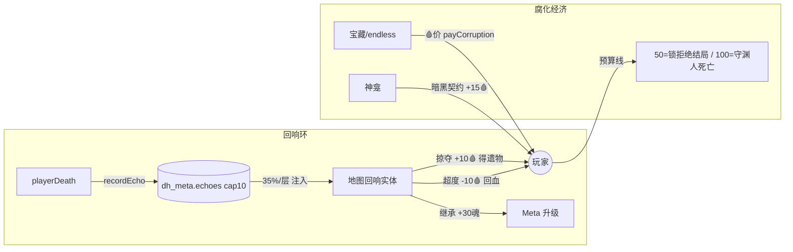

# TECH 批10「深渊记账+回响」— A 腐化经济 × B 回响系统

- 状态: 设计已获用户批准（2026-08-31 会话：A+B 组合、吃进腐化方向、UI 温和精修不涉及本批）
- 基线: main @ `c7a0284`（批9 已并入），vitest 554 绿
- 版本目标: 1.6.0（合并时 bump，见 Follow-ups）

## Context

游戏缺少核心创新钩子。获批方向：把已有**腐化系统扶正为第二货币**（付账=腐化增加，"深渊赊账"），并用**回响系统**作为第一批腐化消费者——死亡留下跨局实体，可掠夺/超度/继承。现状（均 `c7a0284` 实测）：

**腐化**：`Player.corruption` 0..100（`types.ts:484`），唯一写入口 `applyCorruption`（`combat.ts:377-419`，内部挂 eternal_sand 正增量减半 + endless corruption_ward 概率抵消，封顶 100→`wardenDeath`）。档位 20/50/80/100（`corruption.ts:22-35`）。结局锁线 `REFUSE_CORRUPTION_THRESHOLD = 50`（`endings.ts:12`，≥50 丢拒绝结局）。HUD 腐化条已有（`render.ts:504-508`）。低层入口 `addCorruption`（`corruption.ts:56-61`，仅 clamp 无修正链）——**支付必须走这层**（见 Risks）。

**商店**：三处内联金币扣款互不共享——`merchantBuy`（`events.ts:81-82`）、`buyTreasure`（`events.ts:338-339`）、`buyEndless`（`events.ts:416-417`）。批9 后商人常驻（`npcPersists`，`npc-rules.ts`），宝藏价 `treasurePrice`（`events.ts:275`，420/880+8f），endless 条目带 `kind` 判别（gear/relic/purge/heal）。弹窗骨架 `#event-popup`/`eventActions` 数字键 1-9（`input.ts:148-153`）。

**神龛**（`events.ts:176-189`）：踩上先看腐化——有腐化走净化 -20；否则 **20% 随机**大祝福（+2 atk/def +10 maxHp，`shrineBuff`，消耗地块）。

**死亡/meta**：`playerDeath`（`combat.ts:432`）内 `recordRun`（:460，RunRecord 只有 层/职业/击杀/时间，**无死因无装备**）、`buildEpitaph`（:486，墓志铭只进 DOM 不落盘）。meta 单键 `dh_meta`（`meta.ts:11`），`getMeta` 逐字段迁移（`meta.ts:35-55`，`if (!m.X) m.X = …` 惯例），已在 Steam Cloud 17 键内。跨局实体先例：`recordWardenLegacy → dh_meta.wardens → spawnWarden`（`enemies.ts:110-137`）。`creditSoulEchoes`（`meta.ts:222`）= 现成 meta 货币入账。

**实体注入**：`enterFloor` setup（`game.ts:99-127`）是全部地图实体唯一汇聚点；批9 后消费端 `player.ts` 走 `npcPersists` 守卫（白名单=三类商人；**非白名单默认消耗**——echo 实体零改动即可正确消亡）。存档 `dh_save` 整体序列化 `G.items`（含实体上的 stock），纯 JSON 回程。

## Proposed changes

### B1 数据层（先做，A/B 共同地基）

- `types.ts` 新增 `EchoRecord`：
```ts
interface EchoRecord {
  cause: DeathCause; killer: string; floor: number; turns: number;
  classIdx: number; corruption: number;
  keepsake: Item | null;            // 整件快照（Item 是纯 JSON 对象，dh_save/dh_meta 双向安全）
  epitaph: { template: string; flavor: string };  // buildEpitaph 的现成产物，落盘不再只进 DOM
  ts: number;
}
```
- `meta.ts`：`MetaSave.echoes?: EchoRecord[]`；`getMeta` 迁移加一行 `if (!m.echoes) m.echoes = []`；`recordEcho(rec)`（unshift、cap 10，镜像 `recordRun` 的 runHistory 惯例）。
- `combat.ts` `playerDeath`：`buildEpitaph` 之后调 `recordEcho`；keepsake = `p.inv` + 已装备中稀有度最高的一件（无则 null）。
- 云同步零成本（`dh_meta` 已在 `PROFILE_KEYS`）。

### B2 回响注入与交互

- `game.ts` `enterFloor` 注入区：`floor >= 2 && Math.random() < 0.35 && getMeta().echoes.length` 时随机取一条，`placeEntity` 同型闭包 push `{ npc: 'echo', echo: <record快照>, spriteKind: 'ECHO', … }`。消费端零改动（`npcPersists('echo') === false` → 踩上即消耗，宝箱同款）。
- `events.ts` `triggerNpc` 加分支 → `openEchoEvent(entity)`：弹窗标题=「回响」，desc=墓志铭 template + flavor；三动作（全部经 `addCorruption`/`applyCorruption(-n)` 正负各自正确入口）：
  - **掠夺**：+10 腐化，keepsake 经 `addItemWithOverflow` 入包（null 则该动作降级为 +5 腐化换 50 金的残渣）。终审 I1 后过 `canPayCorruption` 95 硬线**双门**：渲染时按钮置灰（`disabled` + `.45` 透明度）+ 闭包内复验，被封锁时不关弹窗可改选超度/继承（终审裁定：95 线对全部腐化入账口 UNIVERSAL）
  - **超度**：`applyCorruption(-10)`（负向走正门，圣物/meta 修正链对负增量本就不作用），回复 40% maxHp
  - **继承**：`creditSoulEchoes(30)`（复用现成 meta 货币，零新机制）
- `sprites.ts`：新 `T_ECHO` 模板 + 调色（批3c 模式，刻意**不进** THEME_PAL 承重墙）。
- i18n 新键（en/zh 成对，过 parity 门）：`ev.echoTitle/echoDesc/echoLoot/echoLootEmpty/echoPurify/echoInherit` + 各结果消息 ~4 条 + A 侧 ~4 条（见 A 节），共 ~14 键。

### A1 共享支付函数

新纯叶模块 `src/cost.ts`（`npc-rules.ts` 先例）：
```ts
// 吃进腐化：付账=腐化增加。走 addCorruption（低层 clamp 入口）而非 applyCorruption——
// 修正链（eternal_sand 减半/corruption_ward 概率抵消）会把"支付"变成"折扣"或"免费"，见 spec Risks。
export function corruptionPriceOf(goldPrice: number): number {
  return Math.max(5, Math.min(25, Math.round(goldPrice / 45)));
}
export function canPayCorruption(cur: number, cost: number): boolean {
  return cur + cost <= 95;   // 永不因购物跨进 100 死亡线（可调）
}
export function payCorruption(p: Player, cost: number): boolean {
  if (!canPayCorruption(p.corruption, cost)) return false;
  addCorruption(p, cost);    // clamp + 档位边界由上层 recalc 消化
  return true;
}
```
三处内联扣款点不动金币逻辑、只加第二按钮调用 `payCorruption`（金币路径行为不变）。

### A2 双价签（宝藏 + endless 商人）

- 两店每个 gear/relic 条目渲染**双买键**：`[n] 💰价` 与 `[n+1] 🩸corruptionPriceOf(价)`；`canPayCorruption` 不满足时腐化键禁用并提示（`ev.tooCorrupted`）。
- 按钮预算：宝藏 3 条目 ×2 + leave = **7 actions，全部带 1-9 数字键** ✓；endless 带 relic 时 = **11 actions**（3 gear ×2 + relic ×2 + purge + heal + leave），>9 的动作经 `keyTag` 省略数字前缀（4dbfcb8 裁定：不可按的假键标比缺键更糟），heal/leave 可经 鼠标点击 / Tab 焦点 / 手柄焦点 / ESC 到达。
- 流浪商人/事件站**不加**双价签（保持廉价日常店定位，腐化消费集中在 premium 场景=回响/宝藏/endless/神龛）。
- 数值锚：F5 宝藏 460/920 金 → 🩸10/20；endless F45 gear 3600 → 封顶 25。预算张力=离 50 锁线与 100 死亡线的距离，v1 不改腐化获取渠道（tunable 留给 playtest）。

### A3 神龛暗祝福

`events.ts:176-189` 重构：有腐化时净化 -20 路径**不变**；无腐化时把 20% 随机祝福改为**二选一弹窗**（`showEvent` 骨架）：
- `[1] 洁净祈福`：现有数值（+2 atk/def +10 maxHp）
- `[2] 暗黑契约`：`payCorruption(+15)` 成功则双倍祝福（+4 atk/def +20 maxHp）+ 视觉金→紫；失败（腐化余量不足）则回落洁净祝福并提示
神龛地块两路都消耗（现状语义）。

## End-to-end flow



## Testing and validation

行为不变量 → 验证映射（TDD 全程）：

| 不变量 | 验证 |
|---|---|
| B-A `getMeta` 对旧档补 `echoes:[]`，`recordEcho` cap 10 newest-first | 单测（meta 迁移惯例同 wardens） |
| B-B `playerDeath` 落 EchoRecord（死因/keepsake 最高稀有度/墓志铭原文） | 单测（mock meta，断言字段） |
| B-C floor≥2 且池非空 35% 注入；`npcPersists('echo')===false` 踩上即消耗 | 单测（rng 钉死 + npc-rules 断言） |
| B-D 三交互各自生效（+10🩸得物 / -10🩸+40%回血 / +30 soulEchoes），keepsake null 走降级 | 单测 |
| A-A `corruptionPriceOf` 数值表（460→10、920→20、3600→25、30→5） | 单测 |
| A-B `canPayCorruption` 95 线：85+15=false、80+15=true（边界=95 放行）；`payCorruption` 走 `addCorruption` 不经修正链 | 单测（spy addCorruption/applyCorruption 调用） |
| A-C 宝藏双键购买：金币路径回归不变；腐化路径扣腐化得物；余量不足禁用 | 单测 + battery |
| A-D 神龛二选一：暗黑契约双倍祝福；余量不足回落 | 单测 |
| 全量 | vitest 554+N / tsc 0 / build / smoke 65 / gamepad 22 / battery 27+新增组 / 零 console 错 |

Battery 新组（`verify_batch10_ingame.py`，crib 批9 脚本骨架）：①自杀造 echo→新局验证注入→三交互各跑一遍 ②宝藏商人🩸购买全路径 ③神龛暗黑契约 ④支付封锁（腐化 85 时 🩸15 键禁用）。

## Parallelization

同批9 模式：SDD 顺序派发（实现互不并行，文件交叠集中在 events.ts/meta.ts）；任务序 T1 数据层→T2 注入+交互（含 sprite/i18n）→T3 支付函数+双价签→T4 神龛→T5 battery+门禁→final review(opus)。不派并行实现者的理由：B1 是 B2/A 的共同依赖，A2/A3 都改 events.ts 相邻区域，协调成本高于收益。

## Risks and mitigations

- **支付×修正链陷阱（最高危）**：`applyCorruption` 的 eternal_sand 减半会让腐化价五折、corruption_ward 概率抵消会**白送道具**。缓解：`payCorruption` 只走 `addCorruption` + 单测 spy 锁死调用路径。
- **购物致死**：`canPayCorruption` 95 硬线让支付永不触发 100 死亡；代价是极致黑契约玩家少 5 点可用额度（可调）。
- **平衡面**：腐化价全表 tunable 常量集中在 `cost.ts`；v1 不动获取渠道，playtest 后再调。
- **旧档/云兼容**：`echoes` 缺失字段迁移兜底；旧版本读新 `dh_meta` 会忽略未知字段（JSON 直读，无 schema 校验）——无害。
- **popup 按钮数**：宝藏 7 actions 全键内；endless 带 relic 11 actions，>9 经 `keyTag` 省略数字前缀，heal/leave 走 鼠标/Tab/手柄焦点/ESC；手柄 `eventActions` 路径零改动。
- **回响实体进存档**：record 快照内嵌实体（不存 meta 索引，避免 cap 轮转漂移）；`dh_save` JSON 往返已由 stock 先例证明。

## Follow-ups

- 版本 bump 1.6.0 + 打包（批9+批10 一起）。
- backlog 承接：批9 遗留 tooltip 第三 anchor 类型（静止光标键盘消耗）/ escAttr 合并 / T6①⑤ DOM tooltip 收尾——与 A/B 无耦合，可搭车。
- playtest 后调参：腐化价表 / 回响注入率 / 继承魂量。
- 远期候选：守渊人敌意×腐化联动（当前无代码联系，本批不建）。
