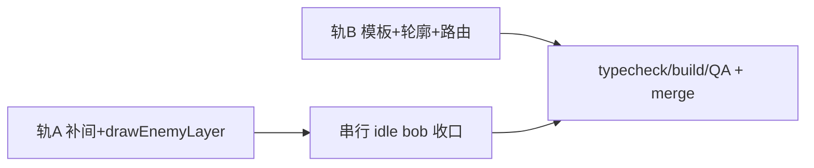

# Wave 5:视觉与手感打磨(敌人移动补间 + sprite 美术升级)

技术规格。对应 `darkhollow`。本规格是 Wave 5 实现与验收的唯一对照基准。

提交基准:`d6e2305`(Wave 4-C4 merge 后的 main HEAD)。代码引用 pin 此 commit。

---

## Context

两块视觉/手感债(用户选定的「视觉与手感」打磨方向):

1. **敌人移动瞬移**。Wave 1 给玩家做了 tile 补间——玩家 sprite 从静态 snapshot 层移入动态层([`render.ts` drawPlayerLayer @ d6e2305](https://github.com/xieyj22/darkhollow_win/blob/d6e2305/src/render.ts#L40-L56)),由 [`particles.ts` tick()](https://github.com/xieyj22/darkhollow_win/blob/d6e2305/src/particles.ts#L86-L154) 每帧在 snapshot 之上按 `currentTweenPos()`(easeOutQuad 90ms)重绘。但当时**只补间玩家,敌人留静态层**——敌人在 [`render.ts:199-245`](https://github.com/xieyj22/darkhollow_win/blob/d6e2305/src/render.ts#L199-L245) 被 bake 进 snapshot,每回合 `render()` 画一次,移动时 tile 间硬切。

2. **sprite 单调**。全游戏 ~25 个敌人只有 **5 个轮廓模板**(GOBLIN/SKELETON/SLIME/BEAST/DEMON)+ BOSS([`sprites.ts` TEMPLATES @ d6e2305](https://github.com/xieyj22/darkhollow_win/blob/d6e2305/src/sprites.ts#L16)),由 [`pickEnemyTemplate`](https://github.com/xieyj22/darkhollow_win/blob/d6e2305/src/sprites.ts#L701-L710) 按 tag/name 路由。Wave 4-C1 加的 9 个敌人大量错配:烈焰飞龙/龙裔骑士用 DEMON、铁卫统领/石化魔像/破城巨像用 GOBLIN、雷霆怨灵用 SKELETON、熔岩巨兽用 BEAST。模板是 16×16 像素矩阵,单色派生调色板(M/D/L,[`buildPalette`](https://github.com/xieyj22/darkhollow_win/blob/d6e2305/src/sprites.ts#L625-L638)),offscreen canvas 缓存([`getSprite`](https://github.com/xieyj22/darkhollow_win/blob/d6e2305/src/sprites.ts#L648-L665)),`imageSmoothingEnabled=false` blit。

关键既有机制(本规格复用):

- 玩家补间全套设施(`_playerTween`/`setPlayerTween`/`currentTweenPos`/`drawPlayerLayer`)与 late-binding 接线([`setDrawPlayerLayerFn`](https://github.com/xieyj22/darkhollow_win/blob/d6e2305/src/particles.ts#L9-L12))。
- 敌人移动**单一咽喉点** [`tryMove`](https://github.com/xieyj22/darkhollow_win/blob/d6e2305/src/enemies.ts#L304-L312):chase/wander/erratic/ambush/ranged/lifesteal/summon/fear/ally 全走这里改 `e.x/e.y`。两处直接改位置例外:`phase` AI([enemies.ts:138](https://github.com/xieyj22/darkhollow_win/blob/d6e2305/src/enemies.ts#L138),正常 1 格滑步)、`teleport` AI([enemies.ts:223](https://github.com/xieyj22/darkhollow_win/blob/d6e2305/src/enemies.ts#L223),瞬移不应补间——对齐 Wave 3 玩家传送修复 #4)。
- [`Enemy`](https://github.com/xieyj22/darkhollow_win/blob/d6e2305/src/types.ts#L219-L242) 是被 save 序列化的运行时对象([`SaveData.enemies`](https://github.com/xieyj22/darkhollow_win/blob/d6e2305/src/types.ts#L477))。

---

## 目标与范围

- **Part A — 敌人移动补间**:所有标准 AI 移动的敌人在 tile 间 90ms easeOutQuad 滑动,对齐玩家手感;teleport 仍瞬移;reducedMotion 瞬切。
- **Part B — sprite 美术升级(均衡)**:加 5 个标志性敌人专有模板 + 全实体深色 stamp 轮廓(可读性)+ 调色细化 + 轻微闲置呼吸动画。

非目标:更多 boss 模板(boss 已靠颜色+光环区分)、物品 sprite 大改、Steam 激活(待 AppID)。

---

## Proposed changes

### Part A — 敌人移动补间

1. **补间存储** — 在 `render.ts` 加模块级 `WeakMap<Enemy, {fx,fy,tx,ty,t0}>`(命名 `_enemyTweens`)。按对象引用键控,敌人 GC 自动清条目 → **不改 `Enemy` 类型、不进 save**。比玩家补间简单:敌人移动在 `processEnemies` 内同步一次性完成,无中途链式触发,故**不需要**玩家那套 resume-from-visual-pos 逻辑。

2. **`setEnemyTween(e, fx, fy, tx, ty)`** — 两个守卫:`reducedMotion` → 直接 return(瞬切,不留条目);`fx===tx && fy===ty` → return(无位移,覆盖未实际移动)。`t0 = performance.now()`,沿用 `TWEEN_DUR_MS = 90` 与 easeOutQuad。

3. **Hook 点** — [`tryMove`](https://github.com/xieyj22/darkhollow_win/blob/d6e2305/src/enemies.ts#L304-L312) 成功路径:赋值前抓 `ox=e.x, oy=e.y`,赋值后调 `setEnemyTween(e, ox, oy, e.x, e.y)`。一处覆盖绝大多数 AI。另在 `phase` AI 直接移动处([enemies.ts:138](https://github.com/xieyj22/darkhollow_win/blob/d6e2305/src/enemies.ts#L138))同样补一行。**teleport AI([enemies.ts:223](https://github.com/xieyj22/darkhollow_win/blob/d6e2305/src/enemies.ts#L223))不补**——已有 `⚡BLINK` fx。召唤生成的新敌无补间(直接出现)。

4. **渲染迁移** — 把 [`render.ts:199-245`](https://github.com/xieyj22/darkhollow_win/blob/d6e2305/src/render.ts#L199-L245) 敌人渲染块抽成新导出函数 `drawEnemyLayer(c: CanvasRenderingContext2D)`,逻辑原样保留(bg 着色 / boss 光环 / elite 元素光 / sprite / 元素角标 / HP 条),仅把位置源从 `(e.x,e.y)` 改为「补间激活时取插值位置,否则 `(e.x,e.y)`」。从 `render()` 删掉该块(敌人不再进 snapshot;物品/陷阱/地形留 snapshot)。经新 late-binding `setDrawEnemyLayerFn` 接入 [`particles.ts tick()`](https://github.com/xieyj22/darkhollow_win/blob/d6e2305/src/particles.ts#L86-L154),调用顺序:snapshot → **drawEnemyLayer** → drawPlayerLayer → 粒子 → fx → 震屏(敌人在玩家之下,与现状一致——玩家本就在动态层压在 snapshot 之上)。

5. **reducedMotion** → 无补间、无闲置动画。

### Part B — sprite 美术升级

1. **5 个新模板**(16×16,沿用 [`TEMPLATES`](https://github.com/xieyj22/darkhollow_win/blob/d6e2305/src/sprites.ts#L16) 格式 + `buildPalette` 单色派生):

| 模板 | 覆盖敌人(原错配) | 路由依据 |
|------|-------------------|----------|
| DRAGON(有翼爬行) | 烈焰飞龙 / 龙裔骑士 / Ancient Dragon(原 DEMON) | tag `dragon` / name 正则 |
| GOLEM(重甲构装) | 铁卫统领 / 石化魔像 / 破城巨像(原 GOBLIN) | tag `construct` / name |
| WRAITH(兜帽幽灵,W 像素半透感) | 雷霆怨灵 / spirits(原 SKELETON) | tag `spirit` / name |
| ELEMENTAL(火焰/能量体) | 熔岩巨兽 / elementals(原 BEAST/DEMON) | tag `elemental` / name |
| CULTIST(长袍人形,区别于 goblin) | 龙血信徒 / 圣裁官 / 施法者(原 GOBLIN) | tag `cultist` / name |

   [`pickEnemyTemplate`](https://github.com/xieyj22/darkhollow_win/blob/d6e2305/src/sprites.ts#L701-L710) 改为**先按 tag**(扩展判据:`dragon`/`construct`/`spirit`/`elemental`/`cultist`)再 name 正则,保留现有 5 模板兜底。需要的 tag 在 [`data.ts` ENEMIES](https://github.com/xieyj22/darkhollow_win/blob/d6e2305/src/data.ts#L96) 对应条目补(纯数据追加,低风险)。`drawEnemySprite` 的 cache sig 增加模板 key 维度。

2. **Stamp 轮廓** — 新增 `blitOutlined(c, x, y, sprite, thickness=1)`:把深色(`#0a0a0a`)轮廓 sprite 按 ±thickness 在 4(或 8)方向 stamp,再 blit 本体。pixel-art 经典做法,对杂色地形背景可读性提升显著。**关键协调点:`drawEnemySprite`/`drawBossSprite`/`drawItemSprite`/`drawPlayerSprite` 对外签名不变**——轮廓在 sprites.ts 内部默认开启,调用方(render.ts/legend)无感,避免与 Part A 迁移同一调用行冲突。boss 略厚(thickness=2)。

3. **调色细化** — 新模板刻意用 M/D/L 三调;大形体(龙翼/魔像板甲)可加第 4 个中间调(扩展 `buildPalette` 加 `T` mid-tone)。保持单色派生,使每敌人主题色仍生效。

4. **闲置呼吸动画** — 依赖 Part A 的动态层。在 `drawEnemyLayer` 里给每个敌人加细微纵向 bob:sin 波 ±1px、~2s 周期、按敌人 entity 相位偏移(不同步);SLIME 模板改纵向 squish(拉伸)而非平移。reducedMotion 关闭。玩家可选加轻微 bob(已在动态层)。**串行步骤,必须在 Part A 完成后做。**

5. **Legend/Help** — [`paintIcon`](https://github.com/xieyj22/darkhollow_win/blob/d6e2305/src/sprites.ts#L757-L771) 共享 TEMPLATES,新模板一旦在 legend 引用即自动出现;确认 legend 把 5 个新种类映射上。

---

## Global Constraints

- **reducedMotion 硬约束**:补间与闲置动画在 reducedMotion 下全部退化为瞬切/静止(对齐玩家补间与既有 a11y 体系)。
- **不改 `Enemy` 类型、不污染 save**:补间状态走 WeakMap,绝不落 `Enemy` 字段;`SaveData` 不受影响。
- **性能预算**:敌人迁入动态层后每帧重画所有可见敌人(≤~15,缓存 sprite)。stamp 轮廓 = 每 sprite 5× drawImage(≤15 敌人 ≈ 75 drawImage/帧)。每帧成本仍由既有 snapshot `drawImage` 主导,增量可接受。boss/elite 的 `createRadialGradient` 每帧重建(已知 P3 项)暂不处理。
- **签名稳定**:sprites.ts 对外 draw* 签名不变(轮廓内置),避免与 Part A 的调用行迁移冲突。
- **汉化**:新模板路由若用到新 tag,仅影响渲染选模板,不涉及 i18n 文本。

---

## Testing and validation

无测试框架(项目惯例),靠 typecheck + build + 手动/视觉 QA。

- `npm run typecheck` + `npm run build` 必过。
- `npm run dev` 手动 QA:
  - **补间**:玩家在敌人附近移动/等待,敌人 chase 时 tile 间平滑滑动(~90ms),不再硬切。
  - **teleport 敌人**:瞬移仍为瞬切 + `⚡BLINK` fx,不滑动。
  - **reducedMotion**(Options→Accessibility 开):敌人瞬切、无 bob。
  - **轮廓**:敌人/boss/物品在暗色地形上有清晰深色描边,可读性提升。
  - **新轮廓**:烈焰飞龙/龙裔骑士=龙形、铁卫统领/破城巨像=构装、雷霆怨灵=幽灵、熔岩巨兽=元素、龙血信徒/圣裁官=长袍——5 种新剪影各不相同。
  - **bob**:静止敌人轻微呼吸、不同步、不抢眼。
  - **legend**:新模板图标正确显示。
  - **回归**:玩家补间/震屏/粒子/fx/HP 条/元素角标无异常;save/load 后敌人位置正常(无幽灵补间残留)。

---

## Parallelization

两轨可并行(文件归属不重叠),idle bob 串行收口:

- **轨 A(补间)** — subagent,owns `render.ts` / `enemies.ts` / `particles.ts`:WeakMap + setEnemyTween + tryMove/phase hook + 抽 drawEnemyLayer + late-binding 接线。local 同一 checkout。
- **轨 B(sprite)** — subagent,owns `sprites.ts` / `data.ts`:5 新模板 + stamp 轮廓(内置,签名不变)+ pickEnemyTemplate 路由 + 补 tag + 调色。local 同一 checkout。
- **串行收口(主 Agent)** — idle bob 写入轨 A 产出的 `drawEnemyLayer`;集成、typecheck/build/手动 QA、ff-merge main。

协调边界:sprites.ts draw* 对外签名不变是两轨不冲突的关键(轨 A 只搬调用行,轨 B 只改被调函数内部)。并发≤2,避开 429。

---

## Follow-ups

- boss/elite `createRadialGradient` 每帧重建缓存化(已知 P3)。
- 物品 sprite 体系大改(独立任务)。
- 更多生物群系/楼层、`summon.kind` 精确召唤、`extra_acc_slot`(内容扩展续)。
- Steamworks 真激活(待 AppID)。
